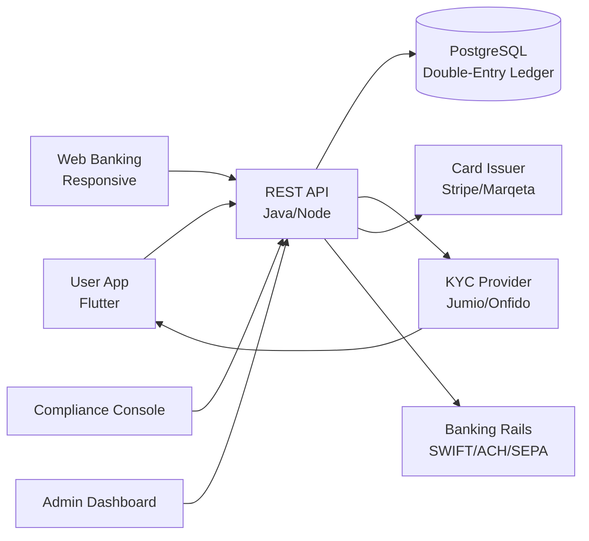

# Wise Clone — White-Label Digital Banking & Finance Platform by Miracuves

**MXWise** is a production-ready, white-label Wise clone: a complete neobank with multi-currency accounts, cards, KYC/AML, and admin console — delivered with **100% source code ownership** in **6 working days**.

> 🏦 **See it running before you talk to anyone.** Live user app, admin console, and compliance dashboard — demo credentials are printed on the [solution page](https://miracuves.com/wise-clone#demo). No sales call required.

---

## 🚀 Live Demos

| Environment | URL | What you can test |
|---|---|---|
| 📱 User App | [mas.mimeld.com](https://mas.mimeld.com) | Accounts, transfers, cards, payments, statements |
| 🌐 Web Banking | [mxwise.mimeld.com](https://mxwise.mimeld.com) | Full banking experience in the browser |
| 🛡️ Compliance Console | [Solution page → Demo](https://miracuves.com/wise-clone#demo) | KYC/AML, transaction monitoring, reports |
| 🛠️ Admin Dashboard | [Solution page → Demo](https://miracuves.com/wise-clone#demo) | Users, accounts, fees, reports, cards |

Demo credentials for all environments: **[miracuves.com/wise-clone → Demo section](https://miracuves.com/wise-clone/#demo)**

---

## ✨ What Makes This Wise Clone Different

Most banking scripts stop at "send + receive." This platform ships with the features that actually run a licensed fintech *business*:

- **KYC/AML Built In** — passport + selfie + liveness verification with sanctions screening and ongoing transaction monitoring — same stack neobanks use to get licensed
- **Multi-Currency Core** — 40+ currencies with real exchange rates, multi-currency cards, and FX-hedged wallets — Revolut's core playbook
- **Issuing-as-a-Service Ready** — Visa and Mastercard BIN sponsorship partners pre-integrated — launch a card product without licensing the bank yourself
- **Open Banking & PSD2** — PSD2/Open Banking aggregators pre-integrated — accounts aggregation, instant payments, SCA flows ready
- **Programmable Ledger** — double-entry ledger built for fintech with reconciliation, holds, reversals, and audit — what Stripe & Plaid run on

## 📦 Core Features

**User:** multi-currency accounts · domestic & international transfers · debit/credit cards · bill payments · savings goals · statements · biometric login · fraud alerts

**Compliance:** KYC/AML onboarding · sanctions screening · transaction monitoring · SAR/CTF reporting · audit trail · jurisdiction-aware controls

**Admin:** user management · account lifecycle · fee schedule · card issuance · dispute resolution · analytics reports

## 🏗️ Architecture

**Stack:** Java Spring Boot or Node.js backend · Flutter mobile apps (Android + iOS) · PostgreSQL with double-entry ledger · Redis for caching · Stripe / Marqeta for card issuing · SWIFT, ACH, SEPA, UPI, IMPS, card networks

## 📋 What’s Included

- ✅ Full source code — backend, web, mobile apps, panels (no encryption, no license locks)
- ✅ Deployment to your servers & app store submission assistance
- ✅ Your branding — white-label rename, logo, colors, domain
- ✅ 60 days post-launch support + 12 months of free updates
- ✅ Documentation & handover

**Pricing:** from **$21,999**, transparent on the [solution page](https://miracuves.com/wise-clone/#pricing) — no "contact us for quote" games.

## 🆚 Why Not Build From Scratch?

Custom neobanks run $300k–$2M and 9–24 months. A proven white-label base gets you to market in 6 working days for a fraction of that, with your budget preserved for licensing, compliance, and marketing.

## 📚 Resources

- 📖 [Wise Clone — Full Solution Page](https://miracuves.com/wise-clone) (features, pricing, demos, FAQ)
- 💰 [How Much Does a Neobank Cost in 2026?](https://miracuves.com/wise-clone#pricing) pricing breakdown & what's included
- 📝 [Best Wise Clone Script in 2026](https://miracuves.com/wise-clone/blog/) features, pricing & launch guide
- 🧠 [KYC/AML Stack for Licensed Fintechs](https://miracuves.com/wise-clone/blog/) providers, flows, ongoing monitoring
- ✅ [Miracuves Facts & Claims Ledger](https://miracuves.com/wise-clone/facts/) every claim we make, verified

## 🏢 About Miracuves

[Miracuves Solutions](https://miracuves.com) builds white-label clone apps and custom software from Mumbai, India — 90+ ready-made solutions, live demos for every product, transparent pricing, and delivery in 6 working days. Operating since 2010.

**Talk to us:** [WhatsApp](https://wa.me/919830009649) · [Schedule a consultation](https://miracuves.com/schedule-consultation/) · [miracuves.com](https://miracuves.com)

---

### ⚠️ Note on This Repository

This repository is a product overview. The full source code is delivered to clients on purchase — see [what’s included](https://miracuves.com/wise-clone/#included). For a hands-on evaluation, use the live demos above; credentials are public on the solution page.

*Keywords: wise clone, wise clone script, digital banking, neobank, fintech platform, white label banking, KYC AML, Flutter banking app, Node.js fintech*

---

<!--
══════════════════════════════════════════════════
TEMPLATE VARIABLE KEY — auto-generated from Netflix-Clone pattern
══════════════════════════════════════════════════
{APP_NAME}        Wise Clone
{MX_NAME}         MXWise
{CATEGORY}        Digital Banking & Finance Platform
{DEMO_WEB}        mxwise.mimeld.com
{PRICE}           $21,999
{SLUG}            wise-clone
{SOLUTION_URL}    https://miracuves.com/wise-clone/
{VERTICAL}        banking

See /tmp/verticals/banking.txt for the vertical config used to generate this README.
══════════════════════════════════════════════════
-->